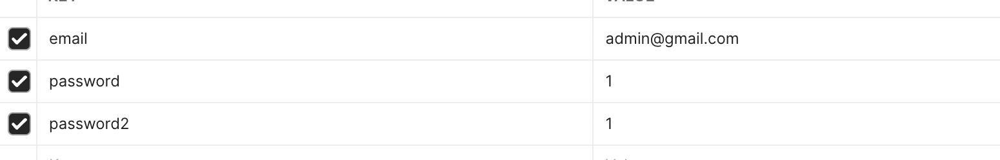
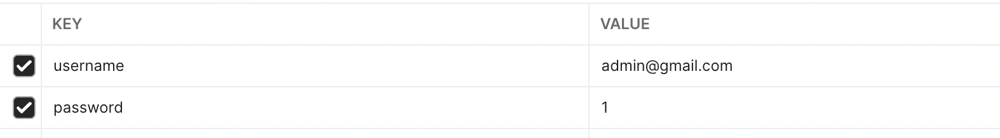
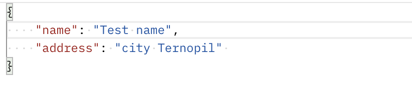
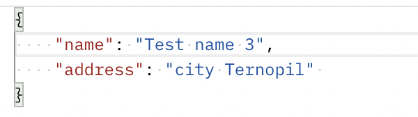
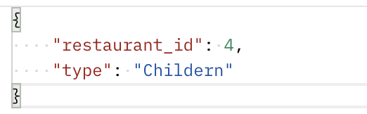
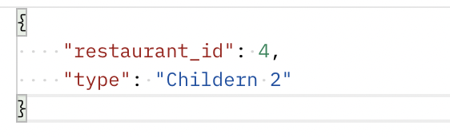
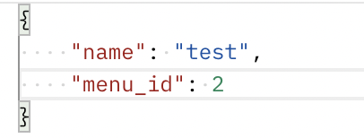
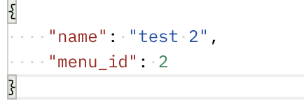
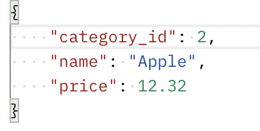
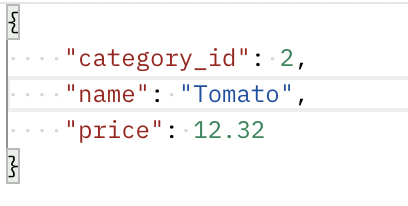

# Test task
___

## Installation

```bash
docker-compose build
```

## Run
```bash
docker-compose up -d
```


## API
- PUBLIC
    - Signup:
      - Method - POST
      - Uri - http://localhost:8002/users/sign-up/
      - Content-type - form-data
      - data 
    - Login:
      - Method - POST
      - Uri - http://localhost:8002/users/create-token/
      - Content-type - form-data
      - data
    - Retrieve user's profile:
      - Method - GET
      - Uri - http://localhost:8002/users/me/
      - Headers - "Authorization: Token fdsgrefre"
    - Create Restaurant:
      - Method - POST
      - Uri http://localhost:8002/create-restaurant/
      - Headers - "Authorization: Token fdsgrefre"
      - Content-type - json
      - data
    - Update Restaurant:
      - Method - PUT
      - Uri http://localhost:8002/restaurant/<restaurant_pk>/
      - Headers - "Authorization: Token fdsgrefre"
      - Content-type - json
      - data 
    - Retrieve Restaurant:
      - Method - GET
      - Uri http://localhost:8002/restaurant/<restaurant_pk>/
      - Headers - "Authorization: Token fdsgrefre"
    - Delete Restaurant:
      - Method - DELETE
      - Uri http://localhost:8002/restaurant/<restaurant_pk>/
      - Headers - "Authorization: Token fdsgrefre"
    - Get Menu:
      - Method - GET
      - Uri http://localhost:8002/menu/
      - Headers - "Authorization: Token fdsgrefre"
    - Create Menu:
      - Method - POST
      - Uri http://localhost:8002/menu/
      - Headers - "Authorization: Token fdsgrefre"
      - Content-type - json
      - data 
    - Update Menu:
      - Method - PUT
      - Uri http://localhost:8002/menu/<menu_pk>/
      - Headers - "Authorization: Token fdsgrefre"
      - Content-type - json
      - data - 
    - Delete Menu:
      - Method - DELETE
      - Uri http://localhost:8002/menu/<menu_pk>/
      - Headers - "Authorization: Token fdsgrefre"
    - Get Category:
      - Method - GET
      - Uri http://localhost:8002/category/
      - Headers - "Authorization: Token fdsgrefre"
    - Create Category:
      - Method - POST
      - Uri http://localhost:8002/category/
      - Headers - "Authorization: Token fdsgrefre"
      - Content-type - json
      - data - 
    - Update Category:
      - Method - PUT
      - Uri http://localhost:8002/category/<category_id>/
      - Headers - "Authorization: Token fdsgrefre"
      - Content-type - json
      - data - 
    - Delete Category:
      - Method - DELETE
      - Uri http://localhost:8002/category/<category_id>/
      - Headers - "Authorization: Token fdsgrefre"
    - Get Product:
      - Method - GET
      - Uri http://localhost:8002/product/
      - Headers - "Authorization: Token fdsgrefre"
    - Create Product:
      - Method - POST
      - Uri http://localhost:8002/product/
      - Headers - "Authorization: Token fdsgrefre"
      - Content-type - json
      - data - 
    - Update Product:
      - Method - PUT
      - Uri http://localhost:8002/product/<product_id>/
      - Headers - "Authorization: Token fdsgrefre"
      - Content-type - json
      - data - 
    - Delete Product:
      - Method - DELETE
      - Uri http://localhost:8002/product/<product_id>/
      - Headers - "Authorization: Token fdsgrefre"
  
- TENANT
  - Retrieve Menu with categories:
    - Method - GET
    - Uri - http://subdomain.localhost:8002/retrieve-menu/<menu_id>/
  
  - Retrieve Category with products:
    - Method - GET
    - Uri - http://subdomain.localhost:8002/retrieve-category/<category_id>/
  
  - Retrieve Product:
    - Method - GET
    - Uri - http://subdomain.localhost:8002/retrieve-product/<product_id>/
    